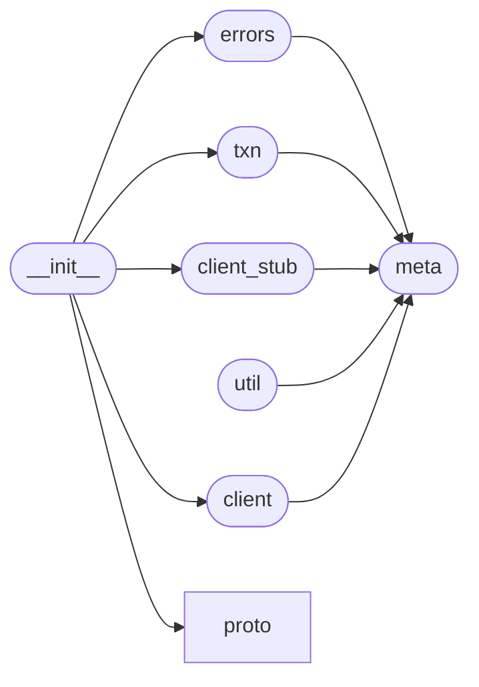

# Code Overview

[_Documentation generated by Documatic_](https://www.documatic.com)

<!---Documatic-section-Codebase Structure Python-start--->
## Codebase Structure Python

The codebase has a single-depth folder structure,
                with 10 code files in total.

<!---Documatic-block-system_architecture-start--->

<!---Documatic-block-system_architecture-end--->

# #
<!---Documatic-section-Codebase Structure Python-end--->

<!---Documatic-section-Key Objects-start--->
## Key Objects

There are exposed imports at level-0
from the source directory (pydgraph)

<!---Documatic-block-pydgraph-start--->

	
<code>pydgraph</code> (Click to Expand!)

* `pydgraph.client.DgraphClient`
* `pydgraph.client.__author__`
* `pydgraph.client.__maintainer__`
* `pydgraph.client.__status__`
* `pydgraph.client.__version__`
* `pydgraph.client_stub.DgraphClientStub`
* `pydgraph.client_stub.__author__`
* `pydgraph.client_stub.__maintainer__`
* `pydgraph.client_stub.__status__`
* `pydgraph.client_stub.__version__`
* `pydgraph.errors.AbortedError`
* `pydgraph.errors.ConnectionError`
* `pydgraph.errors.RetriableError`
* `pydgraph.errors.TransactionError`
* `pydgraph.errors.__author__`
* `pydgraph.errors.__maintainer__`
* `pydgraph.errors.__status__`
* `pydgraph.errors.__version__`
* `pydgraph.proto.api_pb2.Check`
* `pydgraph.proto.api_pb2.Facet`
* `pydgraph.proto.api_pb2.Latency`
* `pydgraph.proto.api_pb2.Mutation`
* `pydgraph.proto.api_pb2.NQuad`
* `pydgraph.proto.api_pb2.Operation`
* `pydgraph.proto.api_pb2.Payload`
* `pydgraph.proto.api_pb2.Request`
* `pydgraph.proto.api_pb2.Response`
* `pydgraph.proto.api_pb2.TxnContext`
* `pydgraph.proto.api_pb2.Value`
* `pydgraph.proto.api_pb2.Version`
* `pydgraph.txn.Txn`
* `pydgraph.txn.__author__`
* `pydgraph.txn.__maintainer__`
* `pydgraph.txn.__status__`
* `pydgraph.txn.__version__`

<!---Documatic-block-pydgraph-end--->

# #
<!---Documatic-section-Key Objects-end--->

<!---Documatic-section-Important Functions-start--->
## Important Functions

<!---Documatic-block-important_funcs-start--->
<!---Documatic-block-most_used_funcs-start--->
### Most Utilised Functions

* pydgraph.client_stub.__author__ (1 times)
* pydgraph.client_stub.__maintainer__ (1 times)
* pydgraph.client_stub.__status__ (1 times)
* pydgraph.client_stub.__version__ (1 times)
* pydgraph.client.__author__ (1 times)
* pydgraph.client.__maintainer__ (1 times)
* pydgraph.client.__status__ (1 times)
* pydgraph.client.__version__ (1 times)
* pydgraph.txn.__author__ (1 times)
* pydgraph.txn.__maintainer__ (1 times)
* pydgraph.txn.__status__ (1 times)
* pydgraph.txn.__version__ (1 times)
* pydgraph.errors.__author__ (1 times)
* pydgraph.errors.__maintainer__ (1 times)
* pydgraph.errors.__status__ (1 times)
* pydgraph.errors.__version__ (1 times)
<!---Documatic-block-most_used_funcs-end--->

<!---Documatic-block-end_user_funcs-start--->
### End User Exposed Functions

* pydgraph.proto.api_pb2.TxnContext
* pydgraph.txn.__status__
* pydgraph.proto.api_pb2.Payload
* pydgraph.proto.api_pb2.Value
* pydgraph.txn.Txn
* pydgraph.client.__maintainer__
* pydgraph.errors.TransactionError
* pydgraph.client.__version__
* pydgraph.proto.api_pb2.NQuad
* pydgraph.errors.__author__
* pydgraph.proto.api_pb2.Latency
* pydgraph.client.__status__
* pydgraph.proto.api_pb2.Response
* pydgraph.errors.__status__
* pydgraph.client_stub.__version__
* pydgraph.errors.__version__
* pydgraph.proto.api_pb2.Mutation
* pydgraph.client.__author__
* pydgraph.proto.api_pb2.Facet
* pydgraph.client_stub.__maintainer__
* pydgraph.client.DgraphClient
* pydgraph.proto.api_pb2.Version
* pydgraph.errors.__maintainer__
* pydgraph.client_stub.DgraphClientStub
* pydgraph.proto.api_pb2.Request
* pydgraph.errors.RetriableError
* pydgraph.txn.__version__
* pydgraph.proto.api_pb2.Check
* pydgraph.errors.ConnectionError
* pydgraph.client_stub.__status__
* pydgraph.txn.__author__
* pydgraph.proto.api_pb2.Operation
* pydgraph.client_stub.__author__
* pydgraph.txn.__maintainer__
* pydgraph.errors.AbortedError
<!---Documatic-block-end_user_funcs-end--->
<!---Documatic-block-important_funcs-end--->

# #
<!---Documatic-section-Important Functions-end--->

<!---Documatic-section-Class Hierarchy-start--->
## Class Hierarchy

<!---Documatic-block-Exception-start--->

	
<code>Exception</code> (Click to Expand!)

* pydgraph.errors.AbortedError
* pydgraph.errors.ConnectionError
* pydgraph.errors.RetriableError
* pydgraph.errors.TransactionError

<!---Documatic-block-Exception-end--->

<!---Documatic-block-object-start--->

	
<code>object</code> (Click to Expand!)

* pydgraph.client.DgraphClient
* pydgraph.client_stub.DgraphClientStub
* pydgraph.proto.api_pb2_grpc.DgraphServicer
* pydgraph.proto.api_pb2_grpc.DgraphStub
* pydgraph.txn.Txn

<!---Documatic-block-object-end--->

# #
<!---Documatic-section-Class Hierarchy-end--->

[_Documentation generated by Documatic_](https://www.documatic.com)