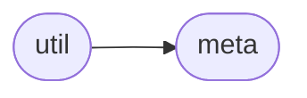

# Pydgraph Util

[_Documentation generated by Documatic_](https://www.documatic.com)

<!---Documatic-section-Codebase Structure-start--->
## Codebase Structure

<!---Documatic-block-system_architecture-start--->

<!---Documatic-block-system_architecture-end--->

# #
<!---Documatic-section-Codebase Structure-end--->

<!---Documatic-section-pydgraph.util.is_string-start--->
## [pydgraph.util.is_string](3-pydgraph_util.md#pydgraph.util.is_string)

<!---Documatic-section-is_string-start--->
<!---Documatic-block-pydgraph.util.is_string-start--->
<details>
	<summary><code>pydgraph.util.is_string</code> code snippet</summary>

```python
def is_string(string):
    if sys.version_info[0] < 3:
        return isinstance(string, basestring)
    return isinstance(string, str)
```
</details>
<!---Documatic-block-pydgraph.util.is_string-end--->
<!---Documatic-section-is_string-end--->

# #
<!---Documatic-section-pydgraph.util.is_string-end--->

<!---Documatic-section-pydgraph.util.is_jwt_expired-start--->
## [pydgraph.util.is_jwt_expired](3-pydgraph_util.md#pydgraph.util.is_jwt_expired)

<!---Documatic-section-is_jwt_expired-start--->
<!---Documatic-block-pydgraph.util.is_jwt_expired-start--->
<details>
	<summary><code>pydgraph.util.is_jwt_expired</code> code snippet</summary>

```python
def is_jwt_expired(exception):
    return 'Token is expired' in str(exception)
```
</details>
<!---Documatic-block-pydgraph.util.is_jwt_expired-end--->
<!---Documatic-section-is_jwt_expired-end--->

# #
<!---Documatic-section-pydgraph.util.is_jwt_expired-end--->

<!---Documatic-section-pydgraph.util.is_aborted_error-start--->
## [pydgraph.util.is_aborted_error](3-pydgraph_util.md#pydgraph.util.is_aborted_error)

<!---Documatic-section-is_aborted_error-start--->
<!---Documatic-block-pydgraph.util.is_aborted_error-start--->
<details>
	<summary><code>pydgraph.util.is_aborted_error</code> code snippet</summary>

```python
def is_aborted_error(error):
    if isinstance(error, grpc._channel._Rendezvous) or isinstance(error, grpc._channel._InactiveRpcError):
        status_code = error.code()
        if status_code == grpc.StatusCode.ABORTED or status_code == grpc.StatusCode.FAILED_PRECONDITION:
            return True
    return False
```
</details>
<!---Documatic-block-pydgraph.util.is_aborted_error-end--->
<!---Documatic-section-is_aborted_error-end--->

# #
<!---Documatic-section-pydgraph.util.is_aborted_error-end--->

<!---Documatic-section-pydgraph.util.is_retriable_error-start--->
## [pydgraph.util.is_retriable_error](3-pydgraph_util.md#pydgraph.util.is_retriable_error)

<!---Documatic-section-is_retriable_error-start--->
<!---Documatic-block-pydgraph.util.is_retriable_error-start--->
<details>
	<summary><code>pydgraph.util.is_retriable_error</code> code snippet</summary>

```python
def is_retriable_error(error):
    msg = str(error)
    return 'Please retry' in msg or 'opIndexing is already running' in msg
```
</details>
<!---Documatic-block-pydgraph.util.is_retriable_error-end--->
<!---Documatic-section-is_retriable_error-end--->

# #
<!---Documatic-section-pydgraph.util.is_retriable_error-end--->

<!---Documatic-section-pydgraph.util.is_connection_error-start--->
## [pydgraph.util.is_connection_error](3-pydgraph_util.md#pydgraph.util.is_connection_error)

<!---Documatic-section-is_connection_error-start--->
<!---Documatic-block-pydgraph.util.is_connection_error-start--->
<details>
	<summary><code>pydgraph.util.is_connection_error</code> code snippet</summary>

```python
def is_connection_error(error):
    msg = str(error)
    return 'Unhealthy connection' in msg or 'No connection exists' in msg
```
</details>
<!---Documatic-block-pydgraph.util.is_connection_error-end--->
<!---Documatic-section-is_connection_error-end--->

# #
<!---Documatic-section-pydgraph.util.is_connection_error-end--->

[_Documentation generated by Documatic_](https://www.documatic.com)